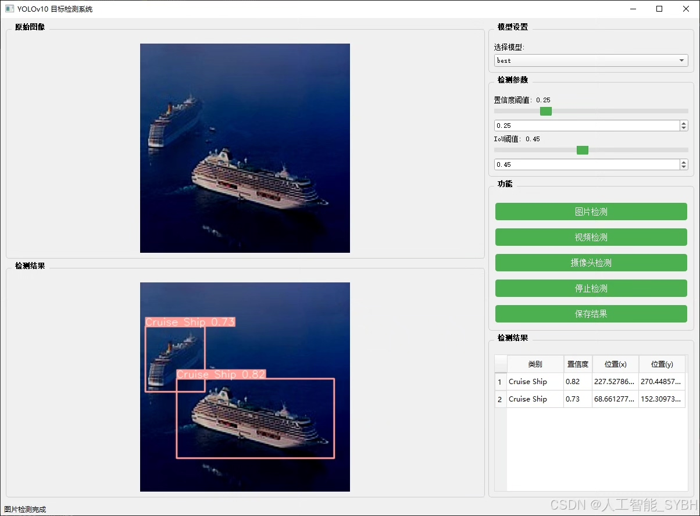
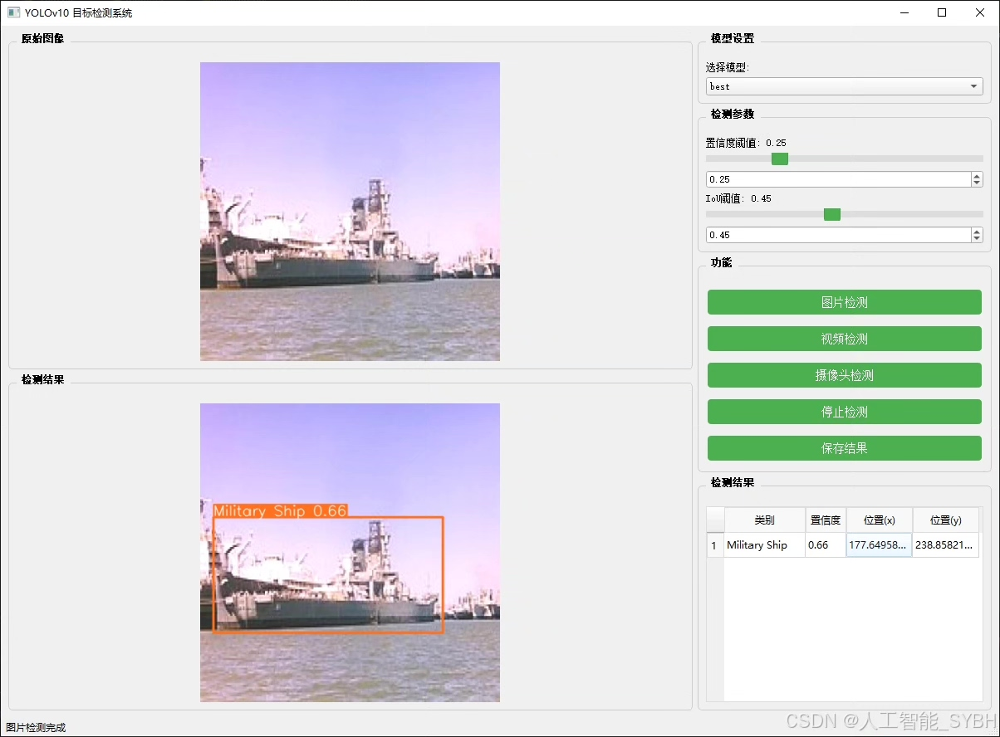
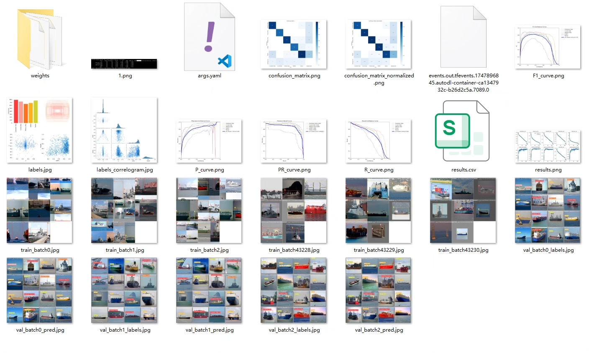
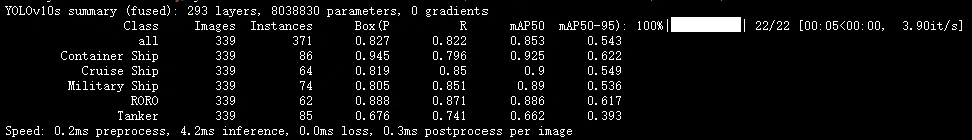
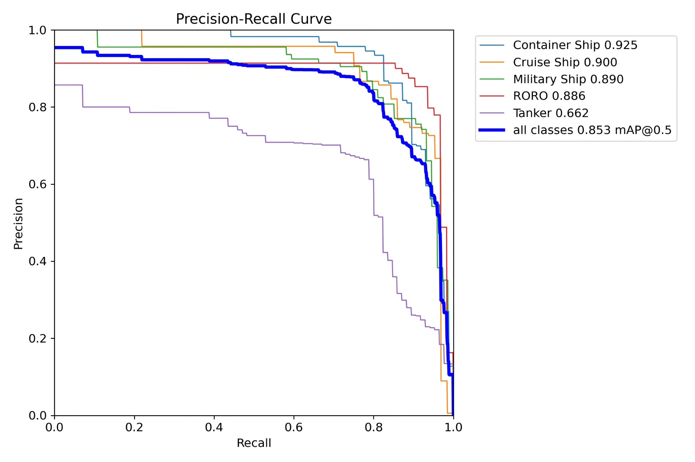
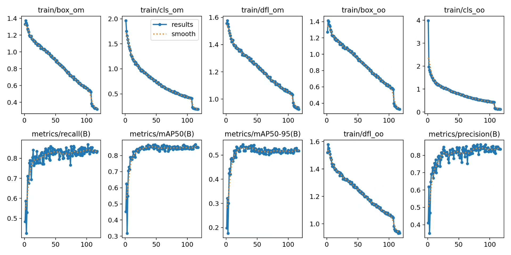
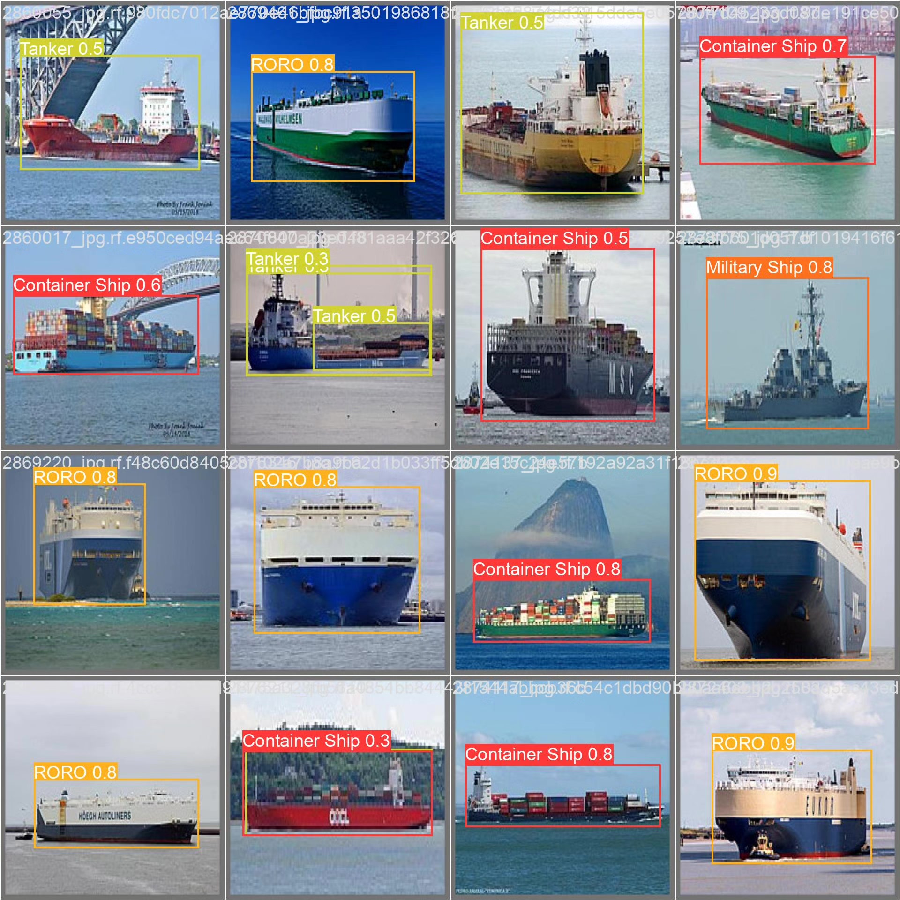

# Based on deep learning YOLOv10 for ship classification and recognition detection system (YOLOv

## Body

This project is based on the state-of-the-art YOLOv10 object detection algorithm, developing a high-precision ship classification and recognition detection system. It can accurately identify and classify five major types of ships: container ships (Container Ship), cruise ships (Cruise Ship), military ships (Military Ship), roll-on/roll-off (RORO) ships, and tankers (Tanker). The system uses a professional dataset containing 3,721 high-quality ship images for training and evaluation, with 3,232 training images, 339 validation images, and 150 test images. This system achieves real-time detection and classification of multiple categories of ships in complex sea conditions, effectively addressing challenges related to different weather conditions, shooting angles, and ship attitudes. The system can be widely applied in various fields such as maritime regulation, port management, maritime search and rescue, national defense security, and marine economic research, providing key technical support for the construction of smart oceans.

The company's products have obtained official commercial license certification from YOLO.

We provide after-sales service.

After payment, we will provide WeChat ID for any questions.

Environmental configuration: We will provide an instruction manual for setting up the environment, and WeChat will provide answers to questions.

Remote installation service: If you need remote configuration, an additional fee of 69 is required.
If the configuration fails, all fees will be refunded (only the installation fee is refundable for older computers).

Retraining dataset: After setting up the environment, you can train on your own computer.
If you need us to retrain, just pay 69 plus computing power fees (2.5 yuan/hour).

Full after-sales service

## Images

## Payment

Here is a pay link on Stripe ( https://buy.stripe.com/3cs8yP7sY87d0vu9AB ). Please contact me lonlonago@foxmail.com after funding $89, and I will send you a complete data files , thank you!

